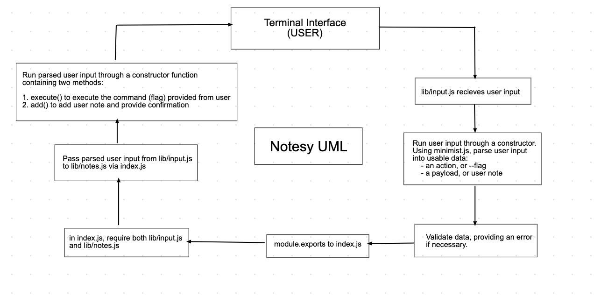

# LAB - Class 03

## Project: Notesy

- A simple CLI note taking app made in Node.js.

### Author: Joe Pennock

- Here's my [Github](https://github.com/penjoe)

### Links and Resources

- [submission PR](https://github.com/joepennock-401-advanced-javascript/notesy/pull/3)
- [ci/cd](https://github.com/joepennock-401-advanced-javascript/notesy/actions) (GitHub Actions)

### Setup

- Have `node` installed on your local machine.
- In terminal, run this command `npm i minimist` to get a CLI input parsing library used in this application.
- Run the command `npm i jest` to install Jest, a testing library this application will be using for running all of the required tests.
-  Ensure that you have MongoDB installed and and can successfully connect.
- RUn the command `npm i mongoose` to install a schema library used with MongoDB.

#### `.env` requirements (where applicable)

Currently no required .env variables.

#### How to initialize/run your application (where applicable)

- Open `Terminal` on your computer, or a similar CLI interface such as `WSL`.
- Start with the command `node index.js` followed by these commands:
  - `-a` or `--add` followd by text to add a new note to Notesy.
    - OPTIONAL: following `add`, use the `-c` or `--category` flag to save a note to a specific category.
  - `-l` or `--list` followed by a desired category to list all notes contained in that category.
  - `-d` or `--delete` followed by a record ID from Mongo to delete a specific note (can be obtained from running the above `list` command).
- Following the desired command, add the body of the note contained within quotations, or " ".
- The command should look something like this:
```
notes --add "This is a new note I'm adding" -c "work notes"
```

#### How to use your library (where applicable)

`minimist` - library needs to be required in the file using it and then is set to a variable and given arguments to parse data from the command line user input
```
const args = minimist(process.argv.slice(2))
```
`mongoose` - this library needs to be required in a schema file. Since MongoDB does not naturally use a schema format, mongoose will model your data like a schema to easily save and format the data. Then, the connection to the Mongo DB is handled through mongoose:
```
mongoose.connect(mongodb://localhost:27017/desired-mongoDB', {
  useNewUrlParser: true,
  useUnifiedTopology: true
});
```

`jest` - This is a testing library that is required within the test files. Check out the [docs](https://jestjs.io/docs/en/getting-started) for more info on testing. 

IMPIRTANT: With jest, make sure to change the scripts in your package.json file:
```
"scripts": {
    "test": "jest --verbose --coverage",
  },
```
This will make sure node knows to run jest when you run a test command.


#### Tests

- << **All testing will require mock data** >>
- Tests for `input.js` are checking for a truthy value if there is valid input provided and a falsey value is there is invalid user input provided:
  - use `jest.mock('minimist)`
  - provide mock user input data
  - run the command `npm test input.test.js`
- Testing for `notes.js` are checking to see whether or not `console.log()` is being caled within the `Note` class. 
  - will require the use of a spy to check if `console.log()` has been called
  - provide mock data
  - run the command `npm test notes.test.js`

#### UML

